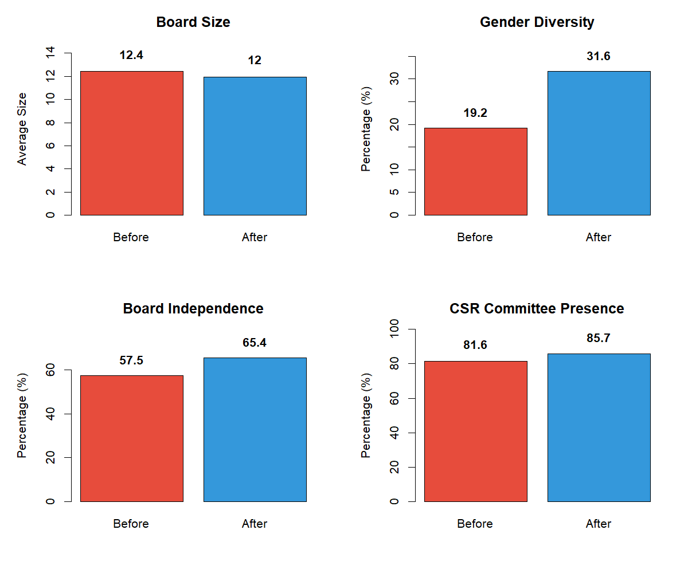
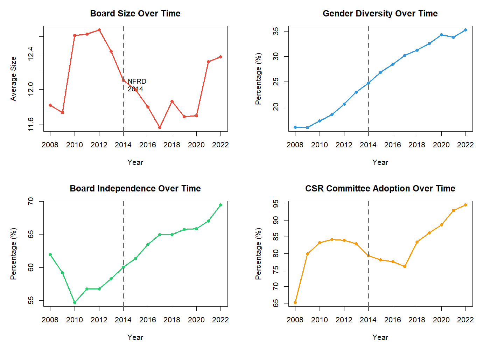

# EU ESG Regulation Impact on Corporate Governance

**Panel Data Analysis | Fixed Effects Regression | Policy Evaluation**

---

## Overview

Did the EU's Non-Financial Reporting Directive (NFRD, 2014) change how European companies structure their boards? This project uses panel data from 588 companies over 15 years (2008-2022) to test whether ESG regulation led to changes in board composition and oversight.

**Research Question:** Did the NFRD regulation cause changes in corporate board characteristics?

**Sample:** 588 European companies  
**Period:** 2008-2022 (6,878 observations)  
**Method:** Fixed effects regression with company and year fixed effects

---

## Why This Matters

The NFRD required large European companies to disclose non-financial information—environmental, social, and governance (ESG) metrics. This project asks: did simply **requiring disclosure** change how companies govern themselves?

This speaks to a broader policy question: can disclosure regulations drive real corporate change?

---

## The Methodological Challenge

Many studies test whether the **relationship between ESG scores and outcomes** changed after regulation. This is problematic because ESG scores themselves are affected by regulation (a "bad control" problem).

**Better approach:** Directly test whether governance outcomes changed after NFRD using within-company variation.

---

## Hypotheses

| Hypothesis | Prediction |
|------------|------------|
| H1 | Board size increases after NFRD |
| H2 | Board independence (% independent directors) increases |
| H3 | Gender diversity (% women on board) increases |
| H4 | CSR committee adoption increases |

---

## Results Summary

### Before vs. After (Raw Means)

| Variable | Before (2008-2013) | After (2014-2022) | Change |
|----------|-------------------|-------------------|--------|
| Board Size | 12.42 | 11.96 | -0.46 |
| Gender Diversity | 19.18% | 31.64% | +12.46% |
| Board Independence | 57.47% | 65.42% | +7.95% |
| CSR Committee | 81.56% | 85.68% | +4.13% |

### Fixed Effects Results (Causal Estimates)

Fixed effects regression compares each company to itself before vs. after NFRD, controlling for time-invariant characteristics.

| Outcome | Coefficient | p-value | Interpretation |
|---------|-------------|---------|----------------|
| Board Size | -0.536 | < 0.001 | Decreased by 0.5 members |
| Board Independence | +8.48% | < 0.001 | Increased by 8.5 percentage points |
| Gender Diversity | +13.65% | < 0.001 | Increased by 13.7 percentage points |
| CSR Committee | +7.8% | < 0.001 | Increased likelihood by 7.8% |

*All results statistically significant at p < 0.001*

---
### Hypothesis Testing

| Hypothesis | Supported? | Finding |
|------------|------------|---------|
| H1: Board size ↑ | No | Size decreased (opposite direction) |
| H2: Board independence ↑ | Yes | +8.5% increase |
| H3: Gender diversity ↑ | Yes | +13.7% increase |
| H4: CSR committees ↑ | Yes | +7.8% increase |

**3 out of 4 hypotheses supported **

## Key Finding: Boards Got Better, Not Bigger

The regulation led to **strategic optimization** rather than mechanical compliance:

- Gender diversity increased from 19.2% to 31.6%
- Board independence increased from 57.5% to 65.4%
- Board size decreased slightly—companies streamlined boards while improving composition
- CSR oversight strengthened—more companies added dedicated committees

This suggests companies responded strategically to disclosure requirements by improving board quality rather than simply adding seats.

---

## Visualizations

### Figure 1: Before-After Comparison


*All four governance metrics changed significantly after NFRD, with gender diversity showing the largest increase.*

### Figure 2: Time Trends (2008-2022)


*The vertical line marks NFRD implementation (2014). Trends show clear shifts after regulation, particularly for gender diversity and board independence.*

---

## Methodology Details

### Model Specification
```r
plm(Outcome ~ nfrd + Employee + age, 
    data = panel_data, 
    model = "within",
    effect = "individual")
```
### Data Quality Note

Analysis uses 2008-2022 (not full 2003-2022) because:
-Pre-2008: 80%+ observations had zero values for gender diversity and board independence
-These were missing data coded as zeros, not actual all-male boards
-Restricting to 2008+ ensures reliable estimates while preserving 6 years pre-treatment (2008-2013)

### Control Variables
- CEO duality (CEO also chairs board)
- Number of employees (firm size)
- Firm age (organizational maturity)

## Project Structure

├── README.md
├── code/
│   └── analysis.R
├── results/
│   ├── descriptive_statistics.csv
│   ├── hypothesis_summary.csv
│   ├── fe_models.txt
│   └── ols_models.txt
└── figures/
    ├── before_after_comparison.png
    └── time_trends.png

## Replication

**Requirements:** R (≥ 4.0), packages: `tidyverse`, `plm`, `lmtest`, `stargazer`

**Run:**
```r
# Install packages
install.packages(c("tidyverse", "plm", "lmtest", "stargazer"))

# Run analysis
source("analysis.R")
```


